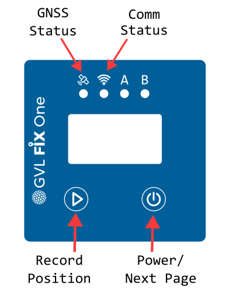

# Getting Started

## Legends

## Usage

* **Press and hold** power button for 2 seconds
	* Device turns on and boots into main screen
* Wait until GNSS Status LED turns **green**
	* Green = RTK Fixed. Highest precision.
	* Ensure open sky above antenna.
* Real-time telemetry is streamed to GVL Dashboard.

## Additional Features

* Press the `Power` button to cycle through information display
* Press the `Play` button to record a **manual survey point**
	* Current coordinates are saved to local storage
	* A special telemetry message is transmitted
* **Press and hold** `Power` button to switch off

## Status LEDs

### GNSS Status

|Colour|Notes|Accuracy (CEP)|
|:--:|:--:|:--:|
|Red|No Signal|-|
|Yellow|Single|2-5 m|
|Blue|Differential|0.5-2 m|
|Purple|RTK Float|0.2-1 m|
|Green|RTK Fixed|1-3 **cm**|
|White|Basestation Mode|-|

### Comm Status

|Colour|Notes|
|:--:|:--:|
|Green|Wi-Fi|
|Blue|Cellular|
|White|Unconfigured|

## Configuration

See the [Configuration Page](./config.md) on how to set up your device.

